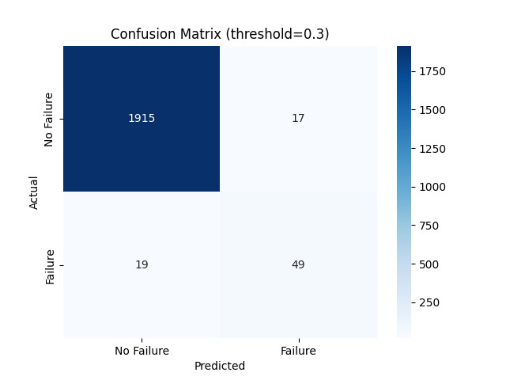
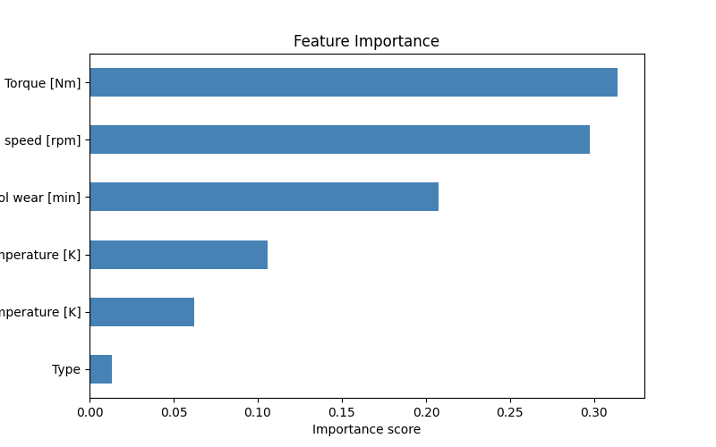

# Predictive Maintenance: Machine Failure Detection

A ML project that predicts industrial machine failures from sensor data.

---

## Objective

Predict whether a machine will fail based on real-time sensor readings (temperature, torque, rotational speed, tool wear), enabling maintenance teams to intervene before a breakdown occurs rather than reacting after the fact.

---

## Dataset

Source: [Predictive Maintenance Dataset (AI4I 2020) — Kaggle](https://www.kaggle.com/datasets/stephanmatzka/predictive-maintenance-dataset-ai4i-2020)

- 10,000 rows representing machine operating cycles
- 6 sensor features used for prediction
- Highly imbalanced: only 3.4% of rows are failures (339 out of 10,000)

| Feature | Description |
|---|---|
| Air temperature [K] | Ambient air temperature |
| Process temperature [K] | Machine internal temperature |
| Rotational speed [rpm] | Spindle rotation speed |
| Torque [Nm] | Rotational force applied |
| Tool wear [min] | Cumulative tool usage time |
| Type | Product quality variant (L / M / H) |

---

## Project Structure

```
predictive-maintenance/
├── data/
│   └── predictive_maintenance.csv
├── notebooks/
│   ├── 01_data_exploration.ipynb
│   └── 02_model_training.ipynb
├── src/
├── README.md
└── requirements.txt
```

---

## Methodology

### 1. Exploratory Data Analysis
- Confirmed class imbalance: 96.6% non-failure vs 3.4% failure
- Visualized sensor distributions split by failure class
- Computed feature correlation matrix.Torque showed the strongest linear relationship with failure (0.19)

### 2. Data Preparation
- Dropped non-predictive columns (UDI, Product ID) and failure-type flags (TWF, HDF, PWF, OSF, RNF) to prevent data leakage
- Encoded categorical Type column (L/M/H → 0/1/2)
- 80/20 train/test split with stratification to preserve failure ratio
- Applied StandardScaler fitted only on training data

### 3. Model Training
- Algorithm: Random Forest Classifier (100 trees)
- Key parameter: `class_weight="balanced"` to handle class imbalance,failure cases weighted ~28x more than non-failure cases
- Threshold adjustment: Lowered decision threshold from 0.5 to 0.3 to maximize recall (catching more real failures at the cost of slightly more false alarms)

---

##  Results

| Metric | Class 0 (No Failure) | Class 1 (Failure) |
|---|---|---|
| Precision | 0.99 | 0.74 |
| Recall | 0.99 | **0.72** |
| F1-score | 0.99 | 0.73 |

**The model catches 72% of machine failures before they happen.**

### Confusion Matrix


- 1915 correct non-failure predictions
- 49 failures correctly caught
- 17 false alarms (unnecessary inspections)
- 19 missed failures out of 68

### Feature Importance


Torque (0.31) and Rotational speed (0.30) are the strongest predictors of failure, followed by Tool wear (0.21). Product type had negligible impact (0.01).

Key insight:Mechanical stress indicators are more predictive of failure than temperature readings which aligns with the physical reality of how milling machines degrade.

---

## Industrial Interpretation

The threshold was deliberately set to 0.3 rather than the default 0.5. In an industrial context, a missed failure (unexpected machine breakdown) is far more costly than a false alarm (unnecessary inspection). Lowering the threshold increased recall from 0.56 to 0.72 — catching 11 additional real failures — at the cost of a small drop in precision.

This trade-off is a deliberate engineering decision, not a limitation.

---

## Tech Stack

- Python 3.
- pandas — data loading and manipulation
- seaborn / matplotlib — visualization
- scikit-learn — preprocessing, model training, evaluation

---

## How to Run

```bash
# Clone the repository
git clone https://github.com/YOUR_USERNAME/predictive-maintenance.git
cd predictive-maintenance

# Create and activate virtual environment
python -m venv venv
.\venv\Scripts\activate  # Windows

# Install dependencies
pip install -r requirements.txt

# Download the dataset from Kaggle and place it in data/
# Then open and run the notebooks in order
```

---

## Requirements

```
pandas
numpy
matplotlib
seaborn
scikit-learn
jupyter
ipykernel
```

---

*Built by Mohamed Moussallak - Student at CentraleSupélec / ESSEC*
